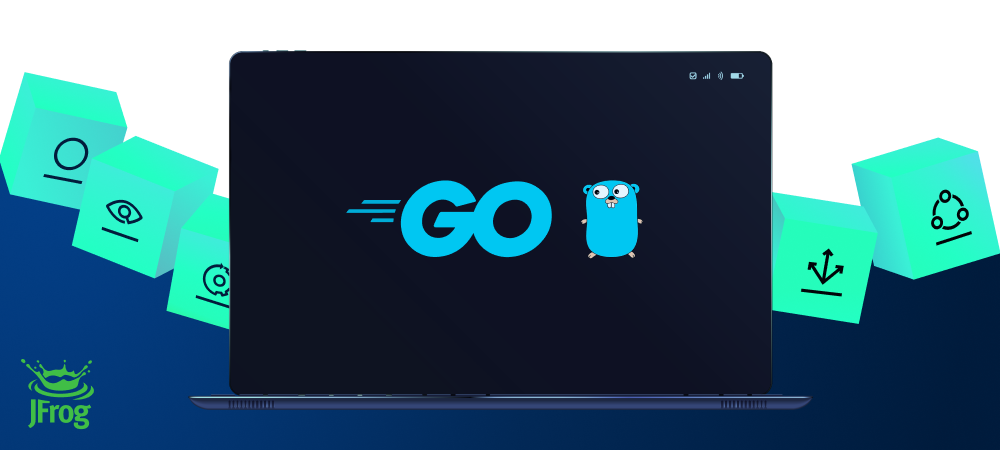

[](#readme)

<div align="center">

# JFrog Go Client

</div>

| Branch |                                                                                                                                                                              Status                                                                                                                                                                              |
|:------:|:----------------------------------------------------------------------------------------------------------------------------------------------------------------------------------------------------------------------------------------------------------------------------------------------------------------------------------------------------------------:|
| master | [](https://github.com/jfrog/jfrog-client-go/actions) [](https://github.com/jfrog/jfrog-client-go/actions/workflows/analysis.yml) |
|  dev   |    [](https://github.com/jfrog/jfrog-client-go/actions) [](https://github.com/jfrog/jfrog-client-go/actions/workflows/analysis.yml)    |

## Table of Contents

- [JFrog Go Client](#jfrog-go-client)
    - [Table of Contents](#table-of-contents)
    - [General](#general)
    - [Pull Requests](#pull-requests)
        - [Guidelines](#guidelines)
    - [Tests](#tests)
        - [Flags](#flags)
            - [Test Types](#test-types)
            - [Connection Details](#connection-details)
    - [General APIs](#general-apis)
        - [Setting the Logger](#setting-the-logger)
        - [Setting the Temp Dir](#setting-the-temp-dir)
    - [Artifactory APIs](#artifactory-apis)
        - [Creating Artifactory Service Manager](#creating-artifactory-service-manager)
            - [Creating Artifactory Details](#creating-artifactory-details)
            - [Creating Artifactory Details with Custom HTTP Client](#creating-artifactory-details-with-custom-http-client)
            - [Creating Artifactory Service Config](#creating-artifactory-service-config)
            - [Creating New Artifactory Service Manager](#creating-new-artifactory-service-manager)
        - [Using Artifactory Services](#using-artifactory-services)
            - [Uploading Files to Artifactory](#uploading-files-to-artifactory)
            - [Downloading Files from Artifactory](#downloading-files-from-artifactory)
            - [Downloading Release Bundles from Artifactory](#downloading-release-bundles-from-artifactory)
            - [Uploading and Downloading Files with Summary](#uploading-and-downloading-files-with-summary)
            - [Copying Files in Artifactory](#copying-files-in-artifactory)
            - [Moving Files in Artifactory](#moving-files-in-artifactory)
            - [Deleting Files from Artifactory](#deleting-files-from-artifactory)
            - [Searching Files in Artifactory](#searching-files-in-artifactory)
            - [Setting Properties on Files in Artifactory](#setting-properties-on-files-in-artifactory)
            - [Deleting Properties from Files in Artifactory](#deleting-properties-from-files-in-artifactory)
            - [Getting Properties from Files in Artifactory](#getting-properties-from-files-in-artifactory)
            - [Publishing Build Info to Artifactory](#publishing-build-info-to-artifactory)
            - [Fetching Build Info from Artifactory](#fetching-build-info-from-artifactory)
            - [Promoting Published Builds in Artifactory](#promoting-published-builds-in-artifactory)
            - [Promoting a Docker Image in Artifactory](#promoting-a-docker-image-in-artifactory)
            - [Triggering Build Scanning with JFrog Xray](#triggering-build-scanning-with-jfrog-xray)
            - [Discarding Old Builds](#discarding-old-builds)
            - [Cleaning Unreferenced Git LFS Files from Artifactory](#cleaning-unreferenced-git-lfs-files-from-artifactory)
            - [Executing AQLs](#executing-aqls)
            - [Reading Files in Artifactory](#reading-files-in-artifactory)
            - [Creating an Access Token](#creating-an-access-token)
            - [Fetching Access Tokens](#fetching-access-tokens)
            - [Fetching Access Tokens of a User](#fetching-access-tokens-of-a-user)
            - [Refreshing an Access Token](#refreshing-an-access-token)
            - [Revoking an Access Token](#revoking-an-access-token)
            - [Create API Key](#create-api-key)
            - [Regenerate API Key](#regenerate-api-key)
            - [Get API Key](#get-api-key)
            - [Creating and Updating Local Repository](#creating-and-updating-local-repository)
            - [Creating and Updating Remote Repository](#creating-and-updating-remote-repository)
            - [Creating and Updating Virtual Repository](#creating-and-updating-virtual-repository)
            - [Creating and Updating Federated Repository](#creating-and-updating-federated-repository)
            - [Removing a Repository](#removing-a-repository)
            - [Getting Repository Details](#getting-repository-details)
            - [Getting All Repositories](#getting-all-repositories)
            - [Check if Repository Exists](#check-if-repository-exists)
            - [Creating and Updating Repository Replications](#creating-and-updating-repository-replications)
            - [Getting a Repository Replication](#getting-a-repository-replication)
            - [Removing a Repository Replication](#removing-a-repository-replication)
            - [Converting a Local Repository to a Federated Repository](#converting-a-local-repository-to-a-federated-repository)
            - [Triggering a Full Federated Repository Synchronisation](#triggering-a-full-federated-repository-synchronisation)
            - [Creating and Updating Permission Targets](#creating-and-updating-permission-targets)
            - [Removing a Permission Target](#removing-a-permission-target)
            - [Fetching a Permission Target](#fetching-a-permission-target)
            - [Fetching Artifactory's Version](#fetching-artifactorys-version)
            - [Fetching Running Artifactory Nodes in a Cluster](#fetching-running-artifactory-nodes-in-a-cluster)
            - [Fetching Artifactory's Service ID](#fetching-artifactorys-service-id)
            - [Fetching Artifactory's Config Descriptor](#fetching-artifactorys-config-descriptor)
            - [Activating Artifactory's Key Encryption](#activating-artifactorys-key-encryption)
            - [Deactivating Artifactory's Key Encryption](#deactivating-artifactorys-key-encryption)
            - [Fetching Users Details](#fetching-users-details)
            - [Fetching All Users Details](#fetching-all-users-details)
            - [Creating Inviting and Updating a User](#creating-inviting-and-updating-a-user)
            - [Deleting a User](#deleting-a-user)
            - [Fetching All Groups](#fetching-all-groups)
            - [Fetching Group Details](#fetching-group-details)
            - [Creating and Updating a Group](#creating-and-updating-a-group)
            - [Deleting a Group](#deleting-a-group)
            - [Generating Full System Export](#generating-full-system-export)
            - [Getting Info of a Folder in Artifactory](#getting-info-of-a-folder-in-artifactory)
            - [Getting a listing of files and folders within a folder in Artifactory](#getting-a-listing-of-files-and-folders-within-a-folder-in-artifactory)
            - [Getting Storage Summary Info of Artifactory](#getting-storage-summary-info-of-artifactory)
            - [Triggerring Storage Info Recalculation in Artifactory](#triggerring-storage-info-recalculation-in-artifactory)
    - [Access APIs](#access-apis)
        - [Creating Access Service Manager](#creating-access-service-manager)
            - [Creating Access Details](#creating-access-details)
            - [Creating Access Service Config](#creating-access-service-config)
            - [Creating New Access Service Manager](#creating-new-access-service-manager)
        - [Using Access Services](#using-access-services)
            - [Creating a New Project](#creating-a-new-project)
            - [Updating a Project](#updating-a-project)
            - [Deleting a Project](#deleting-a-project)
            - [Assigning Repository to Project](#assigning-repository-to-project)
            - [Unassigned Repository from Project](#unassigning-repository-from-project)
            - [Get all groups assigned to a project](#get-all-groups-assigned-to-a-project)
            - [Get a specific group assigned to a project](#get-a-specific-group-assigned-to-a-project)
            - [Add or update a group assigned to a project](#add-or-update-a-group-assigned-to-a-project)
            - [Remove a group from a project](#remove-a-group-from-a-project)
    - [Distribution APIs](#distribution-apis)
        - [Creating Distribution Service Manager](#creating-distribution-service-manager)
            - [Creating Distribution Details](#creating-distribution-details)
            - [Creating Distribution Service Config](#creating-distribution-service-config)
            - [Creating New Distribution Service Manager](#creating-new-distribution-service-manager)
        - [Using Distribution Services](#using-distribution-services)
            - [Setting Distribution Signing Key](#setting-distribution-signing-key)
            - [Creating a Release Bundle](#creating-a-release-bundle)
            - [Updating a Release Bundle](#updating-a-release-bundle)
            - [Signing a Release Bundle](#signing-a-release-bundle)
            - [Async Distributing a Release Bundle](#async-distributing-a-release-bundle)
            - [Sync Distributing a Release Bundle](#sync-distributing-a-release-bundle)
            - [Getting Distribution Status](#getting-distribution-status)
            - [Deleting a Remote Release Bundle](#deleting-a-remote-release-bundle)
            - [Deleting a Local Release Bundle](#deleting-a-local-release-bundle)
    - [Using ContentReader](#using-contentreader)
    - [Xray APIs](#xray-apis)
        - [Creating Xray Service Manager](#creating-xray-service-manager)
            - [Creating Xray Details](#creating-xray-details)
            - [Creating Xray Service Config](#creating-xray-service-config)
            - [Creating New Xray Service Manager](#creating-new-xray-service-manager)
        - [Using Xray Services](#using-xray-services)
            - [Fetching Xray's Version](#fetching-xrays-version)
            - [Creating an Xray Watch](#creating-an-xray-watch)
            - [Get an Xray Watch](#get-an-xray-watch)
            - [Update an Xray Watch](#update-an-xray-watch)
            - [Delete an Xray Watch](#delete-an-xray-watch)
            - [Creating a Security Xray Policy](#creating-a-security-xray-policy)
            - [Creating a License Xray Policy](#creating-a-license-xray-policy)
            - [Get an Xray Policy](#get-an-xray-policy)
            - [Update an Xray Policy](#update-an-xray-policy)
            - [Delete an Xray Policy](#delete-an-xray-policy)
            - [Add Builds to Indexing Configuration](#add-builds-to-indexing-configuration)
            - [Request Graph Scan](#request-graph-scan)
            - [Retrieve the Graph Scan Results](#retrieve-the-graph-scan-results)
            - [Generate Vulnerabilities Report](#generate-vulnerabilities-report)
            - [Get Vulnerabilities Report Details](#get-vulnerabilities-report-details)
            - [Get Vulnerabilities Report Content](#get-vulnerabilities-report-content)
            - [Delete Vulnerabilities Report](#delete-vulnerabilities-report)
            - [Get Artifact Summary](#get-artifact-summary)
    - [Pipelines APIs](#pipelines-apis)
        - [Creating Pipelines Service Manager](#creating-pipelines-service-manager)
            - [Creating Pipelines Details](#creating-pipelines-details)
            - [Creating Pipelines Service Config](#creating-pipelines-service-config)
            - [Creating New Pipelines Service Manager](#creating-new-pipelines-service-manager)
        - [Using Pipelines Services](#using-pipelines-services)
            - [Fetching Pipelines' System Info](#fetching-pipelines-system-info)
            - [Creating GitHub Integration](#creating-github-integration)
            - [Creating GitHub Enterprise Integration](#creating-github-enterprise-integration)
            - [Creating Bitbucket Integration](#creating-bitbucket-integration)
            - [Creating Bitbucket Server Integration](#creating-bitbucket-server-integration)
            - [Creating Gitlab Integration](#creating-gitlab-integration)
            - [Creating Artifactory Integration](#creating-artifactory-integration)
            - [Get Integration by Id](#get-integration-by-id)
            - [Get Integration by Name](#get-integration-by-name)
            - [Get All Integrations](#get-all-integrations)
            - [Delete Integration](#delete-integration)
            - [Add Pipeline Source](#add-pipeline-source)

## General

_jfrog-client-go_ is a library which provides Go APIs to performs actions on JFrog Artifactory, Xray and Distribution
from your Go application.
The project is still relatively new, and its APIs may therefore change frequently between releases.
The library can be used as a go-module, which should be added to your project's go.mod file. As a reference you may look
at [JFrog CLI](https://github.com/jfrog/jfrog-cli-go)'
s [go.mod](https://github.com/jfrog/jfrog-cli-go/blob/master/go.mod) file, which uses this library as a dependency.

## Pull Requests

We welcome pull requests from the community.

### Guidelines

- If the existing tests do not already cover your changes, please add tests.
- Pull requests should be created on the **dev** branch.
- Please use gofmt for formatting the code before submitting the pull request.

## Tests

To run the tests on the source code, you'll need a running JFrog instance. See the _Prerequisites_ column in the _Test
Types_ section below for more information.

Use the following command with the below options to run the tests.

```sh
go test -v github.com/jfrog/jfrog-client-go/tests -timeout 0 [test-types] [flags]
```

If you'd like to run a specific test, add the test function name using the `-run` flag. For example:

```sh
go test -v github.com/jfrog/jfrog-client-go/tests -timeout 0 -run TestGetArtifactoryVersionWithCustomHttpClient -test.artifactory -rt.url=http://127.0.0.1:8081/artifactory -rt.user=admin -rt.password=password
```

**Note:** The tests create an Artifactory repository named _jfrog-client-tests-repo1_. Once the tests are completed, the
content of this repository is deleted.

### Flags

#### Test Types

| Type                 | Description        | Prerequisites                 |
|----------------------|--------------------|-------------------------------|
| `-test.artifactory`  | Artifactory tests  | Artifactory Pro               |
| `-test.distribution` | Distribution tests | Artifactory with Distribution |
| `-test.xray`         | Xray tests         | Artifactory with Xray         |
| `-test.pipelines`    | Pipelines tests    | JFrog Pipelines               |
| `-test.access`       | Access tests       | Artifactory Pro               |
| `-test.repositories` | Access tests       | Artifactory Pro               |

#### Connection Details

| Flag                | Description                                                                                            |
|---------------------|--------------------------------------------------------------------------------------------------------|
| `-rt.url`           | [Default: http://localhost:8081/artifactory] Artifactory URL.                                          |
| `-ds.url`           | [Optional] JFrog Distribution URL.                                                                     |
| `-xr.url`           | [Optional] JFrog Xray URL.                                                                             |
| `-pipe.url`         | [Optional] JFrog Pipelines URL.                                                                        |
| `-access.url`       | [Optional] JFrog Access URL.                                                                           |
| `-rt.user`          | [Default: admin] Artifactory username.                                                                 |
| `-rt.password`      | [Default: password] Artifactory password.                                                              |
| `-rt.apikey`        | [Optional] Artifactory API key.                                                                        |
| `-rt.sshKeyPath`    | [Optional] Ssh key file path. Should be used only if the Artifactory URL format is ssh://[domain]:port |
| `-rt.sshPassphrase` | [Optional] Ssh key passphrase.                                                                         |
| `-pipe.accessToken` | [Optional] Pipelines access token.                                                                     |
| `-pipe.vcsToken`    | [Optional] Vcs token for Pipelines tests (should have admin permissions).                              |
| `-pipe.vcsRepo`     | [Optional] Vcs full repo path for Pipelines tests (ex: "domain/myrepo").                               |
| `-pipe.vcsBranch`   | [Optional] Vcs branch for Pipelines tests (ex: "main").                                                |
| `-access.token`     | [Optional] Access access token.                                                                        |
| `-ci.runId`         | [Optional] A unique identifier used as a suffix to create repositories in the tests.                   |

## General APIs

### Setting the Logger

Default logger:

```go
log.SetLogger(log.NewLogger(log.INFO, nil))
```

You may also log to a file, and/or add log prefixes as shown below:

```go
var file *os.File
// Log flags as described in https://pkg.go.dev/log#pkg-constants.
logFlags := Ldate | Ltime
...
log.SetLogger(log.NewLoggerWithFlags(log.DEBUG, file, logFlags))
```

### Setting the Temp Dir

The default temp dir used is 'os.TempDir()'. Use the following API to set a new temp dir:

```go
fileutils.SetTempDirBase(filepath.Join("my", "temp", "path"))
```

## Artifactory APIs

### Creating Artifactory Service Manager

#### Creating Artifactory Details

```go
rtDetails := auth.NewArtifactoryDetails()
rtDetails.SetUrl("http://localhost:8081/artifactory")
rtDetails.SetSshKeyPath("path/to/.ssh/")
rtDetails.SetApiKey("apikey")
rtDetails.SetUser("user")
rtDetails.SetPassword("password")
rtDetails.SetAccessToken("accesstoken")
// if client certificates are required
rtDetails.SetClientCertPath("path/to/.cer")
rtDetails.SetClientCertKeyPath("path/to/.key")
```

#### Creating Artifactory Details with Custom HTTP Client

```go
proxyUrl, err := url.Parse("http://proxyIp:proxyPort")
myCustomClient := &http.Client{Transport: &http.Transport{Proxy: http.ProxyURL(proxyUrl)}}

rtDetails := auth.NewArtifactoryDetails()
rtDetails.SetUrl("http://localhost:8081/artifactory")
rtDetails.SetSshKeysPath("path/to/.ssh/")
rtDetails.SetApiKey("apikey")
rtDetails.SetUser("user")
rtDetails.SetPassword("password")
rtDetails.SetAccessToken("accesstoken")
serviceConfig, err := config.NewConfigBuilder().
    SetServiceDetails(rtDetails).
    SetDryRun(false).
    SetHttpClient(myCustomClient).
    Build()
```

#### Creating Artifactory Service Config

```go
serviceConfig, err := config.NewConfigBuilder().
    SetServiceDetails(rtDetails).
    SetCertificatesPath(certPath).
    SetThreads(threads).
    SetDryRun(false).
    // Add [Context](https://golang.org/pkg/context/)
    SetContext(ctx).
    // Optionally overwrite the default HTTP timeout, which is set to 30 seconds.
    SetHttpTimeout(180 * time.Second).
    // Optionally overwrite the default HTTP retries, which is set to 3.
    SetHttpRetries(8).
    Build()
```

#### Creating New Artifactory Service Manager

```go
rtManager, err := artifactory.New(serviceConfig)
```

### Using Artifactory Services

#### Uploading Files to Artifactory

Using the `UploadFiles()` function, we can upload files and get the general statistics of the action (The actual number
of successful and failed uploads), and the error value if it occurred.

```go
params := services.NewUploadParams()
params.Pattern = "repo/*/*.zip"
params.Target = "repo/path/"
params.AddVcsProps = false
params.BuildProps = "build.name=buildName;build.number=17;build.timestamp=1600856623553"
params.Recursive = true
params.Regexp = false
params.IncludeDirs = false
params.Flat = true
params.ExplodeArchive = false
params.Archive = "zip"
params.Deb = ""
params.Symlink = false
params.Exclusions = "(.*)a.zip"
// Retries default value: 3
params.Retries = 5
// The min file size in bytes for "checksum deploy".
// "Checksum deploy" is the action of calculating the file checksum locally, before
// the upload, and skipping the actual file transfer if the file already
// exists in Artifactory.
// MinChecksumDeploy default value: 10400
params.MinChecksumDeploy = 15360
// Set to false to disable all checksum calculation, including "checksum deploy".
// ChecksumsCalcEnabled default value: true
params.ChecksumsCalcEnabled = false
// Attach properties to the uploaded files
targetProps := utils.NewProperties()
targetProps.AddProperty("key1", "val1")
params.TargetProps = targetProps

totalUploaded, totalFailed, err := rtManager.UploadFiles(params)
```

#### Downloading Files from Artifactory

Using the `DownloadFiles()` function, we can download files and get the general statistics of the action (The actual
number of files downloaded, and the number of files we expected to download). In addition, we get the error value if it
occurred.

```go
params := services.NewDownloadParams()
params.Pattern = "repo/*/*.zip"
params.Target = "target/path/"
// Filter the downloaded files by properties.
params.Props = "key1=val1;key2=val2"
params.Recursive = true
params.IncludeDirs = false
params.Flat = false
params.Explode = false
params.Symlink = true
params.ValidateSymlink = false
params.Exclusions = "(.*)a.zip"
// Retries default value: 3
params.Retries = 5
// SplitCount default value: 3
params.SplitCount = 2
// MinSplitSize default value: 5120
params.MinSplitSize = 7168

totalDownloaded, totalFailed, err := rtManager.DownloadFiles(params)
```

#### Downloading Release Bundles from Artifactory

Using the `DownloadFiles()` function, we can download release bundles and get the general statistics of the action (The
actual number of files downloaded, and the number of files we expected to download). In addition, we get the error value
if it occurred.

It is possible to validate the downloaded release bundle's files by providing a local path to a GPG public key file (the
public GPG key should of course correspond to the private GPG key which was used to sign the release bundle).

```go
params := services.NewDownloadParams()
// Path on the local file system to which the files should be downloaded.
params.Target = "target/path/"
// Bundle's name and version should be separated with "/".
params.Bundle = "bundleName/10"
// Optional GPG validation
params.PublicGpgKey = "public/key/file/path"
totalDownloaded, totalFailed, err := rtManager.DownloadFiles(params)
```

Read more about GPG signing release bundles [here](https://www.jfrog.com/confluence/display/JFROG/GPG+Signing).

#### Uploading and Downloading Files with Summary

The methods `UploadFilesWithSummary()` and `DownloadFilesWithSummary()` are similar to `UploadFlies()`
and `DownloadFlies()`, but return an OperationSummary struct, which allows iterating over the details of the
uploaded/downloaded files.<br>
The OperationSummary struct contains:

- TotalSucceeded - the number of successful uploads/downloads
- TotalFailed - the number of failed uploads/downloads
- TransferDetailsReader - a ContentReader of FileTransferDetails structs, with a struct for each successful transfer of
  file
- ArtifactsDetailsReader - a ContentReader of ArtifactDetails structs, with a struct for each artifact in Artifactory
  that was uploaded/downloaded successfully

The ContentReaders can be closed separately by calling `Close()` on each of them, or they both can be closed at once by
calling `Close()` on the OperationSummary struct.

```go
params := services.NewUploadParams()
params.Pattern = "repo/*/*.zip"
params.Target = "repo/path/"

summary, err := rtManager.UploadFilesWithSummary(params)
defer summary.Close()
reader, totalDownloaded, totalExpected, err := rtManager.DownloadFilesWithResultReader(params)

// Iterate over each file
for currentFileInfo := new(utils.FileInfo); reader.NextRecord(currentFileInfo) == nil; currentFileInfo = new(utils.FileInfo) {
     fmt.Printf("File path: %s\n", currentFileInfo.LocalPath)
}

if err := reader.GetError(); err != nil {
    return err
}
```

Read more about [ContentReader](#using-contentReader).

#### Copying Files in Artifactory

```go
params := services.NewMoveCopyParams()
params.Pattern = "repo/*/*.zip"
params.Target = "target/path/"
// Filter the files by properties.
params.Props = "key1=val1;key2=val2"
params.Recursive = true
params.Flat = false

rtManager.Copy(params)
```

#### Moving Files in Artifactory

```go
params := services.NewMoveCopyParams()
params.Pattern = "repo/*/*.zip"
params.Target = "target/path/"
// Filter the files by properties.
params.Props = "key1=val1;key2=val2"
params.Recursive = true
params.Flat = false

rtManager.Move(params)
```

#### Deleting Files from Artifactory

```go
params := services.NewDeleteParams()
params.Pattern = "repo/*/*.zip"
// Filter the files by properties.
params.Props = "key1=val1;key2=val2"
params.Recursive = true

pathsToDelete, err := rtManager.GetPathsToDelete(params)
if err != nil {
    return err
}
defer pathsToDelete.Close()
rtManager.DeleteFiles(pathsToDelete)
```

Read more about [ContentReader](#using-contentReader).

#### Searching Files in Artifactory

```go
params := services.NewSearchParams()
params.Pattern = "repo/*/*.zip"
// Filter the files by properties.
params.Props = "key1=val1;key2=val2"
params.Recursive = true

reader, err := rtManager.SearchFiles(params)
if err != nil {
    return err
}
defer reader.Close()
```

Read more about [ContentReader](#using-contentReader).

#### Setting Properties on Files in Artifactory

```go
searchParams = services.NewSearchParams()
searchParams.Recursive = true
searchParams.IncludeDirs = false

reader, err = rtManager.SearchFiles(searchParams)
if err != nil {
    return err
}
defer reader.Close()
propsParams = services.NewPropsParams()
propsParams.Pattern = "repo/*/*.zip"
propsParams.Reader = reader
// Filter the files by properties.
propsParams.Props = "key=value"

rtManager.SetProps(propsParams)
```

Read more about [ContentReader](#using-contentReader).

#### Deleting Properties from Files in Artifactory

```go
searchParams = services.NewSearchParams()
searchParams.Recursive = true
searchParams.IncludeDirs = false

resultItems, err = rtManager.SearchFiles(searchParams)
if err != nil {
    return err
}
defer reader.Close()
propsParams = services.NewPropsParams()
propsParams.Pattern = "repo/*/*.zip"
propsParams.Reader = reader
// Filter the files by properties.
propsParams.Props = "key=value"

rtManager.DeleteProps(propsParams)
```

#### Getting Properties from Files in Artifactory

```go
rtManager.GetItemProperties("repo/path/file")
```

Read more about [ContentReader](#using-contentReader).

#### Publishing Build Info to Artifactory

```go
buildInfo := &buildinfo.BuildInfo{}
// Optional Artifactory project key
projectKey := "my-project-key"
...
rtManager.PublishBuildInfo(buildInfo, projectKey)
```

#### Fetching Build Info from Artifactory

```go
buildInfoParams := services.NewBuildInfoParams{}
buildInfoParams.BuildName = "buildName"
buildInfoParams.BuildNumber = "LATEST"
// Optional Artifactory project key
buildInfoParams.ProjectKey = "my-project-key"

rtManager.GetBuildInfo(buildInfoParams)
```

#### Promoting Published Builds in Artifactory

```go
params := services.NewPromotionParams()
params.BuildName = "buildName"
params.BuildNumber = "10"
params.TargetRepo = "target-repo"
params.Status = "status"
params.Comment = "comment"
params.Copy = &trueValue
params.FailFast = true
params.IncludeDependencies = &falseValue
params.SourceRepo = "source-repo"
// Optional Artifactory project key
params.ProjectKey = "my-project-key"

rtManager.PromoteBuild(params)
```

#### Promoting a Docker Image in Artifactory

```go
sourceDockerImage := "hello-world"
sourceRepo := "docker-local-1"
targetRepo := "docker-local-2"
params := services.NewDockerPromoteParams(sourceDockerImage, sourceRepo, targetRepo)

// Optional parameters:
params.TargetDockerImage = "target-docker-image"
params.SourceTag = "42"
params.TargetTag = "43"
params.Copy = true

rtManager.PromoteDocker(params)
```

#### Triggering Build Scanning with JFrog Xray

```go
params := services.NewXrayScanParams()
params.BuildName = buildName
params.BuildNumber = buildNumber

rtManager.XrayScanBuild(params)
```

#### Discarding Old Builds

```go
params := services.NewDiscardBuildsParams()
params.BuildName = "buildName"
params.MaxDays = "max-days"
params.MaxBuilds = "max-builds"
params.ExcludeBuilds = "1,2"
params.DeleteArtifacts = false
params.Async = false
// Optional Artifactory project key
projectKey := "my-project-key"

rtManager.DiscardBuilds(params)
```

#### Cleaning Unreferenced Git LFS Files from Artifactory

```go
params := services.NewGitLfsCleanParams()
params.Refs = "refs/remotes/*"
params.Repo = "my-project-lfs"
params.GitPath = "path/to/git"

reader,err := rtManager.GetUnreferencedGitLfsFiles(params)

defer reader.Close()
rtManager.DeleteFiles(reader)
```

#### Executing AQLs

```go
rtManager.Aql(aql string)
```

#### Reading Files in Artifactory

```go
rtManager.ReadRemoteFile(FilePath string)
```

#### Creating an Access Token

```go
params := services.NewCreateTokenParams()
params.Scope = "api:* member-of-groups:readers"
params.Username = "user"
params.ExpiresIn = 3600 // default -1 (use server default)
params.GrantType = "client_credentials"
params.Refreshable = true
params.Audience = "jfrt@<serviceID1> jfrt@<serviceID2>"

results, err := rtManager.CreateToken(params)
```

#### Fetching Access Tokens

```go
results, err := rtManager.GetTokens()
```

#### Fetching Access Tokens of a User

```g
results, err := rtManager.GetUserTokens(username)
```

#### Refreshing an Access Token

```go
params := services.NewRefreshTokenParams()
params.AccessToken = "<access token>"
params.RefreshToken = "<refresh token>"
params.Token.Scope = "api:*"
params.Token.ExpiresIn = 3600
results, err := rtManager.RefreshToken(params)
```

#### Revoking an Access Token

```go
params := services.NewRevokeTokenParams()

// Provide either TokenId or Token
params.TokenId = "<token id>"
// params.Token = "access token"

err := rtManager.RevokeToken(params)
```

#### Create API Key

```go
// Returns an error if API key already exists - use RegenerateAPIKey instead.
apiKey, err := rtManager.CreateAPIKey()
```

#### Regenerate API Key

```go
apiKey, err := rtManager.RegenerateAPIKey()
```

#### Get API Key

```go
apiKey, err := rtManager.GetAPIKey()
```

#### Creating and Updating Local Repository

You can create and update a local repository for the following package types:

Alpine, Bower, Cran, Cargo, Chef, Cocoapods, Composer, Conan, Conda, Debian, Docker, Gems, Generic, Gitlfs, Go, Gradle,
Helm, Ivy, Maven, Npm, Nuget, Opkg, Puppet, Pypi, Rpm, Sbt, Swift, Vagrant, and Yum.

Each package type has its own parameters struct, can be created using the method
`New<packageType>LocalRepositoryParams()`.

Example for creating local Generic repository:

```go
params := services.NewGenericLocalRepositoryParams()
params.Key = "generic-repo"
params.Description = "This is a public description for generic-repo"
params.Notes = "These are internal notes for generic-repo"
params.RepoLayoutRef = "simple-default"
params.ArchiveBrowsingEnabled = true
params.XrayIndex = true
params.IncludesPattern = "**/*"
params.ExcludesPattern = "excludedDir/*"
params.DownloadRedirect = true

err = servicesManager.CreateLocalRepository().Generic(params)
```

You can also create a local repository with basic local params:

```go
params := services.NewLocalRepositoryBaseParams()
params.Key = "generic-repo"
params.PackageType = "generic"
params.Description = "This is a public description for generic-repo"
err := servicesManager.CreateLocalRepository(params)
```

Updating local Generic repository:

```go
err = servicesManager.UpdateLocalRepository().Generic(params)
```

#### Creating and Updating Remote Repository

You can create and update a remote repository for the following package types:

Alpine, Bower, Cran, Cargo, Chef, Cocoapods, Composer, Conan, Conda, Debian, Docker, Gems, Generic, Gitlfs, Go, Gradle,
Helm, Ivy, Maven, Npm, Nuget, Opkg, P2, Puppet, Pypi, Rpm, Sbt, Swift, Vcs, and Yum.

Each package type has its own parameters struct, can be created using the method
`New<packageType>RemoteRepositoryParams()`.

Example for creating remote Maven repository:

```go
params := services.NewMavenRemoteRepositoryParams()
params.Key = "maven-central-remote"
params.Url = "https://repo.maven.apache.org"
params.RepoLayoutRef = "maven-2-default"
params.Description = "A caching proxy repository for Maven central"
params.HandleSnapshot = false
params.HandleReleases = true
params.FetchJarsEagerly = true
params.XrayIndex = true
params.AssumedOfflinePeriodSecs = 600
params.SuppressPomConsistencyChecks = true
params.RemoteRepoChecksumPolicyType = "pass-thru"

err = servicesManager.CreateRemoteRepository().Maven(params)
```

Updating remote Maven repository:

```go
err = servicesManager.UpdateRemoteRepository().Maven(params)
```

You can also create a remote repository with basic remote params:

```go
params := services.NewRemoteRepositoryBaseParams()
params.Key = "remote-repo"
params.Url = "https://repo.maven.apache.org"
err := servicesManager.CreateRemoteRepository(params)
```

#### Creating and Updating Virtual Repository

You can create and update a virtual repository for the following package types:

Alpine, Bower, Cran, Chef, Conan, Conda, Debian, Docker, Gems, Generic, Gitlfs, Go, Gradle, Helm, Ivy, Maven, Npm,
Nuget, P2, Puppet, Pypi, Rpm, Sbt, Swift and Yum.

Each package type has its own parameters struct, can be created using the method
`New<packageType>VirtualRepositoryParams()`.

Example for creating virtual Go repository:

```go
params := services.NewGoVirtualRepositoryParams()
params.Description = "This is an aggregated repository for several go repositories"
params.RepoLayoutRef = "go-default"
params.Repositories = {"gocenter-remote", "go-local"}
params.DefaultDeploymentRepo = "go-local"
params.ExternalDependenciesEnabled = true
params.ExternalDependenciesPatterns = {"**/github.com/**", "**/golang.org/**", "**/gopkg.in/**"}
params.ArtifactoryRequestsCanRetrieveRemoteArtifacts = true

err = servicesManager.CreateVirtualRepository().Go(params)
```

You can also create a virtual repository with basic virtual params:

```go
params := services.NewVirtualRepositoryBaseParams()
params.Key = "generic-repo"
params.PackageType = "generic"
params.Description = "This is a public description for generic-repo"
params.Repositories = string[]{"remote-repo","local-repo"}
err := servicesManager.CreateVirtualRepository(params)
```

Updating virtual Go repository:

```go
err = servicesManager.UpdateVirtualRepository().Go(params)
```

#### Creating and Updating Federated Repository

You can create and update a federated repository for the following package types:

Alpine, Bower, Cran, Cargo, Chef, Cocoapods, Composer, Conan, Conda, Debian, Docker, Gems, Generic, Gitlfs, Go, Gradle,
Helm, Ivy, Maven, Npm, Nuget, Opkg, Puppet, Pypi, Rpm, Sbt, Swift Vagrant and Yum

Each package type has its own parameters struct, can be created using the method
`New<packageType>FederatedRepositoryParams()`.

Example for creating federated Generic repository:

```go
params := services.NewGenericFederatedRepositoryParams()
params.Key = "generic-repo"
params.Description = "This is a public description for generic-repo"
params.Notes = "These are internal notes for generic-repo"
params.RepoLayoutRef = "simple-default"
params.ArchiveBrowsingEnabled = true
params.XrayIndex = true
params.IncludesPattern = "**/*"
params.ExcludesPattern = "excludedDir/*"
params.DownloadRedirect = true
params.Members = []services.FederatedRepositoryMemberParams{
		{Url: "http://targetartifactory/artifactory/federatedRepositoryName", Enabled: true},
	}
err = servicesManager.CreateFederatedRepository().Generic(params)
```

You can also create a federated repository with basic federated params:

```go
params := services.NewFederatedRepositoryBaseParams()
params.Key = "generic-repo"
params.PackageType = "generic"
params.Description = "This is a public description for generic-repo"
params.Members = []services.FederatedRepositoryMemberParams{
		{Url: "http://targetartifactory/artifactory/federatedRepositoryName", Enabled: true},
	}
err := servicesManager.CreateFederatedRepository(params)
```

Updating federated Generic repository:

```go
err = servicesManager.UpdateFederatedRepository().Generic(params)
```

#### Removing a Repository

You can remove a repository from Artifactory using its key:

```go
servicesManager.DeleteRepository("generic-repo")
```

#### Getting Repository Details

You can get repository details from Artifactory using its key, and the desired params struct.
The function expects to get the repo key (name) and a pointer to a param struct that will be filled up.
The param struct should contain the desired params fields corresponded to the Artifactory REST API:

```go
repoDetails = services.RepositoryDetails{}
err := servicesManager.GetRepository("maven-repo", &repoDetails)
```

```go
repoDetails = services.LocalRepositoryBaseParams{}
err := servicesManager.GetRepository("maven-repo", &repoDetails)
```

```go
repoDetails = services.MavenLocalRepositoryParams{}
err := servicesManager.GetRepository("maven-repo", &repoDetails)
```

services.RepositoryDetails

#### Getting All Repositories

You can get all repositories from Artifactory:

```go
servicesManager.GetAllRepositories()
```

You can get all repositories from Artifactory filtered according to theirs type and/or theirs package type:

```go
params := services.NewRepositoriesFilterParams()
params.RepoType = "remote"
params.PackageType = "maven"
err := servicesManager.GetAllRepositoriesFiltered(params)
```

#### Check if Repository Exists

You can check whether a repository exists in Artifactory:

```go
exists, err := servicesManager.IsRepoExists()
```

#### Creating and Updating Repository Replications

Example of creating a repository replication:

```go
params := services.NewCreateReplicationParams()
// Source replication repository.
params.RepoKey = "my-repository"
params.CronExp = "0 0 12 * * ?"
params.Username = "admin"
params.Password = "password"
params.Url = "http://localhost:8081/artifactory/remote-repo"
params.Enabled = true
params.SocketTimeoutMillis = 15000
params.EnableEventReplication = true
params.SyncDeletes = true
params.SyncProperties = true
params.SyncStatistics = true
params.PathPrefix = "/path/to/repo"

err = servicesManager.CreateReplication(params)
```

Example of updating a local repository replication:

```go
params := services.NewUpdateReplicationParams()
// Source replication repository.
params.RepoKey = "my-repository"
params.CronExp = "0 0 12 * * ?"
params.Enabled = true
params.SocketTimeoutMillis = 15000
params.EnableEventReplication = true
params.SyncDeletes = true
params.SyncProperties = true
params.SyncStatistics = true
params.PathPrefix = "/path/to/repo"

err = servicesManager.UpdateReplication(params)
```

#### Getting a Repository Replication

You can get a repository replication configuration from Artifactory using its key:

```go
replicationConfiguration, err := servicesManager.GetReplication("my-repository")
```

#### Removing a Repository Replication

You can remove a repository replication configuration from Artifactory using its key:

```go
err := servicesManager.DeleteReplication("my-repository")
```

#### Converting a Local Repository to a Federated Repository

You can convert a local repository to a federated repository using its key:

```go
err := servicesManager.ConvertLocalToFederatedRepository("my-repository")
```

#### Triggering a Full Federated Repository Synchronisation

You can trigger a full federated repository synchronisation for all members using its key:

```go
err := servicesManager.TriggerFederatedRepositoryFullSyncAll("my-repository")
```

You can also trigger a full federated repository synchronisation for a specific member using its key and the members URL

```go
err := servicesManager.TriggerFederatedRepositoryFullSyncMirror("my-repository", "http://localhost:8081/artifactory/my-repository")
```

#### Creating and Updating Permission Targets

You can create or update a permission target in Artifactory.
Permissions are set according to the following conventions:
`read, write, annotate, delete, manage, managedXrayMeta, distribute`
For repositories You can specify the name `"ANY"` in order to apply to all repositories, `"ANY REMOTE"` for all remote
repositories or `"ANY LOCAL"` for all local repositories.

Creating a new permission target :

```go
params := services.NewPermissionTargetParams()
params.Name = "java-developers"
params.Repo = &services.PermissionTargetSection{}
params.Repo.Repositories = []string{"ANY REMOTE", "local-repo1", "local-repo2"}
params.Repo.ExcludePatterns = []string{"dir/*"}
params.Repo.Actions = &services.Actions{}
params.Repo.Actions.Users = map[string][]string{
    "user1": {"read", "write"},
    "user2": {"write", "annotate", "read"},
}
params.Repo.Actions.Groups = map[string][]string{
    "group1": {"manage", "read", "annotate"},
}
// This is the default value that cannot be changed
params.Build = &services.PermissionTargetSection{}
params.Build.Repositories = []string{"artifactory-build-info"}
params.Build.Actions = &services.Actions{}
params.Build.Actions.Groups = map[string][]string{
    "group1": {"manage", "read", "write", "annotate", "delete"},
    "group2": {"read"},
}

err := testsPermissionTargetService.Create(params)
```

Updating an existing permission target :

```go
err = servicesManager.UpdatePermissionTarget(params)
```

#### Removing a Permission Target

You can remove a permission target from Artifactory using its name:

```go
err = servicesManager.DeletePermissionTarget("java-developers")
```

#### Fetching a Permission Target

You can fetch a permission target from Artifactory using its name:

```go
permissionTargetParams, err = servicesManager.GetPermissionTarget("java-developers")
```

If the requested permission target does not exist, a nil value is returned for the _permissionTargetParams_ param, with
a nil error value

#### Fetching Artifactory's Version

```go
version, err := servicesManager.GetVersion()
```

#### Fetching Running Artifactory Nodes in a Cluster

```go
runningNodes, err := servicesManager.GetRunningNodes()
```

#### Fetching Artifactory's Service ID

```go
serviceId, err := servicesManager.GetServiceId()
```

#### Fetching Artifactory's Config Descriptor

Notice: This API is enabled only on self-hosted Artifactory servers

```go
serviceId, err := servicesManager.GetConfigDescriptor()
```

#### Activating Artifactory's Key Encryption

Notice: This API is enabled only on self-hosted Artifactory servers

```go
err := servicesManager.ActivateKeyEncryption()
```

#### Deactivating Artifactory's Key Encryption

Notice: This API is enabled only on self-hosted Artifactory servers

```go
wasEncrypted, err := servicesManager.DeactivateKeyEncryption()
```

#### Fetching Users Details

```go
params := services.NewUserParams()
params.UserDetails.Name = "myUserName"

user, err := serviceManager.GetUser(params)
```

If the requested user does not exist, a nil value is returned for the _User_ param, with a nil error value

#### Fetching All Users Details

You can get all users from Artifactory:

```go
users, err := servicesManager.GetAllUsers()
```

#### Creating Inviting and Updating a User

```go
params := services.NewUserParams()
params.UserDetails.Name = "myUserName"
params.UserDetails.Email = "myUser@jfrog.com"
params.UserDetails.Password = "Password1"
params.UserDetails.Admin = &falseValue
params.UserDetails.Realm = "internal"
params.UserDetails.ProfileUpdatable = &trueValue
params.UserDetails.DisableUIAccess = &falseValue
params.UserDetails.InternalPasswordDisabled = &falseValue
params.UserDetails.groups = []string{"GroupA", "GroupB"}
// Set to true to replace existing user with the same name.
params.ReplaceIfExists = false
err := serviceManager.CreateUser(params)

// Inviting user to the platform.
param.UserDetails.ShouldInvite = &trueValue
param.UserDetails.Source = "cli"
err := serviceManager.CreateUser(params)

params.UserDetails.groups = []string{"GroupA", "GroupB", "GroupC"}
err := serviceManager.UpdateUser(params)

// Set to true to remove a user from every group.
params.UserDetails.ClearGroups = true
err := serviceManager.UpdateUser(params)
```

#### Deleting a User

```go
err := serviceManager.DeleteUser("myUserName")
```

#### Fetching Locked Out Users

```go
lockedUsers, err := serviceManager.GetLockedUsers()
```

#### Unlock Locked Out User

Unlocks a locked out user. This function succeeds even if the user doesn't exist or not locked.

```go
err := serviceManager.UnlockUser("userToUnlock")
```

#### Fetching All Groups

You can get all groups from Artifactory

```go
groups, err := serviceManager.GetAllGroups()
```

#### Fetching Group Details

```go
params := services.NewGroupParams()
params.GroupDetails.Name = "myGroupName"
// Set this param to true to receive the usernames associated with this group
params.IncludeUsers = true

group, err := serviceManager.GetGroup(params)
```

If the requested group does not exist, a nil value is returned for the _Group_ param, with a nil error value

#### Creating and Updating a Group

```go
params := services.NewGroupParams()
params.GroupDetails.Name = "myGroupName"
params.GroupDetails.Description = "Description"
params.GroupDetails.AutoJoin = &falseValue
params.GroupDetails.AdminPrivileges = &trueValue
params.GroupDetails.Realm = "internal"
params.GroupDetails.UsersNames = [2]string{"UserA", "UserB"}
// Set to true in order to replace exist group with the same name
params.ReplaceIfExists = false
err := serviceManager.CreateGroup(params)

params.GroupDetails.Description = "Newer Description"
// Will add UserC to the group (in addition to existing UserA and UserB)
params.GroupDetails.UsersNames = [1]string{"UserC"}

err := serviceManager.UpdateGroup(params)
```

#### Deleting a Group

```go
err := serviceManager.DeleteGroup("myGroupName")
```

#### Generating Full System Export

```go
params := services.NewExportParams("/tmp/")
err := serviceManager.Export(params)
```

#### Getting Info of a Folder in Artifactory

```go
serviceManager.FolderInfo("repo/path/")
```

#### Getting a listing of files and folders within a folder in Artifactory

```go
optionalParams := servicesutils.NewFileListParams()
optionalParams.Deep=               true
optionalParams.Depth=              2
optionalParams.ListFolders=        true
optionalParams.MetadataTimestamps= true
optionalParams.IncludeRootPath=    true
serviceManager.FileList("repo/path/", optionalParams)
```

#### Getting Storage Summary Info of Artifactory

```go
storageInfo, err := serviceManager.GetStorageInfo()
```

#### Triggerring Storage Info Recalculation in Artifactory

```go
err := serviceManager.CalculateStorageInfo()
```

## Access APIs

### Creating Access Service Manager

#### Creating Access Details

```go
accessDetails := accessAuth.NewAccessDetails()
accessDetails.SetUrl("http://localhost:8081/access/")
accessDetails.SetSshKeyPath("path/to/.ssh/")
accessDetails.SetApiKey("apikey")
accessDetails.SetUser("user")
accessDetails.SetPassword("password")
accessDetails.SetAccessToken("accesstoken")
// if client certificates are required
accessDetails.SetClientCertPath("path/to/.cer")
accessDetails.SetClientCertKeyPath("path/to/.key")
```

#### Creating Access Service Config

```go
serviceConfig, err := clientConfig.NewConfigBuilder().
SetServiceDetails(accessAuth).
SetCertificatesPath(certsPath).
SetInsecureTls(accessDetails.InsecureTls).
SetDryRun(isDryRun).
Build()
```

#### Creating New Access Service Manager

```go
accessManager, err := access.New(serviceConfig)
```

### Using Access Services

#### Creating a New Project

```go
adminPriviligies := accessServices.AdminPrivileges{
	ManageMembers:   &trueValue,
	ManageResources: &trueValue,
	IndexResources:  &trueValue,
}
projectDetails := accessServices.Project{
	DisplayName:       "testProject",
	Description:       "My Test Project",
	AdminPrivileges:   &adminPriviligies,
	SoftLimit:         &falseValue,
	StorageQuotaBytes: 1073741825, // needs to be higher than 1073741824
	ProjectKey:        "tstprj",
}
projectParams = accessServices.NewProjectParams()
projectParams.ProjectDetails = projectDetails
err = accessManager.CreateProject(projectParams)
```

#### Updating a Project

```go
adminPriviligies := accessServices.AdminPrivileges{
	ManageMembers:   true,
	ManageResources: true,
	IndexResources:  true,
}
projectDetails := accessServices.Project{
	DisplayName:       "testProject",
	Description:       "My Test Project",
	AdminPrivileges:   &adminPriviligies,
	SoftLimit:         &falseValue,
	StorageQuotaBytes: 1073741825, // needs to be higher than 1073741824
	ProjectKey:        "tstprj",
}
projectParams = accessServices.NewProjectParams()
projectParams.ProjectDetails = projectDetails
err = accessManager.UpdateProject(projectParams)
```

#### Deleting a Project

```go
err = accessManager.DeleteProject("tstprj")
```

#### Assigning Repository to Project

```go
// Params: (repositoryName, projectKey string, isForce bool)
err = accessManager.AssignRepoToProject("repoName", "tstprj", true)
```

#### Unassigning Repository from Project

```go
err = accessManager.AssignRepoToProject("repoName")
```

#### Get all groups assigned to a project

```go
err = accessManager.GetProjectsGroups("tstprj")
```

#### Get a specific group assigned to a project

```go
err = accessManager.GetProjectsGroup("tstprj", "tstgroup")
```

#### Add or update a group assigned to a project

```go
projectGroup := accessServices.ProjectGroup{
  Name:  "tstgroup",
  Roles: []string{"Contributor","Release Manager"},
}
err = accessManager.UpdateGroupInProject("tstprj", "tstgroup", projectGroup)
```

#### Remove a group from a project

```go
err = accessManager.DeleteExistingProjectGroup("tstprj", "tstgroup")
```

## Distribution APIs

### Creating Distribution Service Manager

#### Creating Distribution Details

```go
distDetails := auth.NewDistributionDetails()
distDetails.SetUrl("http://localhost:8081/distribution")
distDetails.SetSshKeyPath("path/to/.ssh/")
distDetails.SetApiKey("apikey")
distDetails.SetUser("user")
distDetails.SetPassword("password")
distDetails.SetAccessToken("accesstoken")
// if client certificates are required
distDetails.SetClientCertPath("path/to/.cer")
distDetails.SetClientCertKeyPath("path/to/.key")
```

#### Creating Distribution Service Config

```go
serviceConfig, err := config.NewConfigBuilder().
    SetServiceDetails(rtDetails).
    SetCertificatesPath(certPath).
    SetThreads(threads).
    SetDryRun(false).
    // Add [Context](https://golang.org/pkg/context/)
    SetContext(ctx).
    // Optionally overwrite the default HTTP retries, which is set to 3.
    SetHttpRetries(8).
    Build()
```

#### Creating New Distribution Service Manager

```go
distManager, err := distribution.New(serviceConfig)
```

### Using Distribution Services

#### Setting Distribution Signing Key

```go
params := services.NewSetSigningKeyParams("private-gpg-key", "public-gpg-key")

err := distManager.SetSigningKey(params)
```

#### Creating a Release Bundle

```go
params := services.NewCreateReleaseBundleParams("bundle-name", "1")
params.Description = "Description"
params.ReleaseNotes = "Release notes"
params.ReleaseNotesSyntax = "plain_text"
targetProps := utils.NewProperties()
targetProps.AddProperty("key1", "val1")
params.SpecFiles = []*utils.CommonParams{{Pattern: "repo/*/*.zip", TargetProps: targetProps}}

// Be default, artifacts that are distributed as part of a release bundle, have the same path in their destination server
// (the edge node) as the path they had on the distributing Artifactory server.
// You have however the option for modifying the target path on edge node. You do this by defining the Target property as shown below.
// The Pattern property is a wildcard based pattern. Any wildcards enclosed in parentheses in the pattern (source)
// path can be matched with a corresponding placeholder in the target path, to determine the path and name
// of the artifact, once distributed to the edge node.
// In the following example, the path in the edge node is similar to the path in the source Artifactory server, except for the additional "dir" level at the root of the repository.
// Pattern: my-repo/(*)/a.zip
// Target: my-repo/dir/{1}/a.zip
pathMappingSpec := &utils.CommonParams{Pattern: "source-repo/(a)/(*.zip)", Target: "target-repo/{1}-{2}"}
params.SpecFiles = append(params.SpecFiles, pathMappingSpec)

// In case: params.SignImmediately == true, the summary contain the release bundle details. Otherwise, summary is nil.
summary, err := distManager.CreateReleaseBundle(params)
```

#### Updating a Release Bundle

```go
params := services.NewUpdateReleaseBundleParams("bundle-name", "1")
params.Description = "New Description"
params.ReleaseNotes = "New Release notes"
params.ReleaseNotesSyntax = "plain_text"
targetProps := utils.NewProperties()
targetProps.AddProperty("key1", "val1")
params.SpecFiles = []*utils.CommonParams{{Pattern: "repo/*/*.zip", TargetProps: targetProps}}

// The Target property defines the target path in the edge node, and can include replaceable in the form of {1}, {2}, ...
// Read more about it in the above "Creating a Release Bundle" section.
pathMappingSpec := &utils.CommonParams{Pattern: "source-repo/(a)/(*.zip)", Target: "target-repo/{1}-{2}"}
params.SpecFiles = append(params.SpecFiles, pathMappingSpec)

// In case: params.SignImmediately == true, the summary contain the release bundle details. Otherwise, summary is nil.
summary, err := distManager.UpdateReleaseBundle(params)
```

#### Signing a Release Bundle

```go
params := services.NewSignBundleParams("bundle-name", "1")
params.GpgPassphrase = "123456"

summary, err := distManager.SignReleaseBundle(params)
```

#### Async Distributing a Release Bundle

```go
params := services.NewDistributeReleaseBundleParams("bundle-name", "1")
distributionRules := utils.DistributionCommonParams{SiteName: "Swamp-1", "CityName": "Tel-Aviv", "CountryCodes": []string{"123"}}}
params.DistributionRules = []*utils.DistributionCommonParams{distributionRules}
// Auto-creating repository if it does not exist
autoCreateRepo := true
err := distManager.DistributeReleaseBundle(params, autoCreateRepo)
```

#### Sync Distributing a Release Bundle

```go
params := services.NewDistributeReleaseBundleParams("bundle-name", "1")
distributionRules := utils.DistributionCommonParams{SiteName: "Swamp-1", "CityName": "Tel-Aviv", "CountryCodes": []string{"123"}}}
params.DistributionRules = []*utils.DistributionCommonParams{distributionRules}
// Auto-creating repository if it does not exist
autoCreateRepo := true
// Wait up to 120 minutes for the release bundle distribution
err := distManager.DistributeReleaseBundleSync(params, 120, autoCreateRepo)
```

#### Getting Distribution Status

```go
params := services.NewDistributionStatusParams()
// Optional parameters:
// If missing, get status for all distributions
params.Name = "bundle-name"
// If missing, get status for all versions of "bundle-name"
params.Version = "1"
// If missing, get status for all "bundle-name" with version "1"
params.TrackerId = "123456789"

status, err := distributeBundleService.GetStatus(params)
```

#### Deleting a Remote Release Bundle

```go
params := services.NewDeleteReleaseBundleParams("bundle-name", "1")
params.DeleteFromDistribution = true
distributionRules := utils.DistributionCommonParams{SiteName: "Swamp-1", "CityName": "Tel-Aviv", "CountryCodes": []string{"123"}}}
params.DistributionRules = []*utils.DistributionCommonParams{distributionRules}
// Set to true to enable sync deletion (the command execution will end when the deletion process ends).
param.Sync = true
// Max minutes to wait for sync deletion.
param.MaxWaitMinutes = 10
err := distManager.DeleteReleaseBundle(params)
```

#### Deleting a Local Release Bundle

```go
params := services.NewDeleteReleaseBundleParams("bundle-name", "1")

err := distManager.DeleteLocalReleaseBundle(params)
```

## Using ContentReader

Some APIs return a `content.ContentReader` struct, which allows reading the API's output. `content.ContentReader`
provides access to large amounts of data safely, without loading all of it into the memory.
Here's an example for how `content.ContentReader` should be used:

````go
reader, err := servicesManager.SearchFiles(searchParams)
if err != nil {
    return err
}

// Remove the data file used by the reader.
defer func() {
    if reader != nil {
        err = reader.Close()
    }
}()

// Iterate over the results.
for currentResult := new(ResultItem); reader.NextRecord(currentResult) == nil; currentResult = new(ResultItem)  {
    fmt.Printf("Found artifact: %s of type: %s\n", currentResult.Name, currentResult.Type)
}
if err := resultReader.GetError(); err != nil {
    return err
}

// Resets the reader pointer back to the beginning of the output. Make sure not to call this method after the reader had been closed using ```reader.Close()```
reader.Reset()
````

- `reader.NextRecord(currentResult)` reads the next record from the reader into `currentResult` of type `ResultItem`.

- `reader.Close()` removes the file used by the reader after it is used (preferably using `defer`).

- `reader.GetError()` returns any error that might have occurred during `NextRecord()`.

- `reader.Reset()` resets the reader back to the beginning of the output.

## Xray APIs

### Creating Xray Service Manager

#### Creating Xray Details

```go
xrayDetails := auth.NewXrayDetails()
xrayDetails.SetUrl("http://localhost:8081/xray")
xrayDetails.SetSshKeyPath("path/to/.ssh/")
xrayDetails.SetApiKey("apikey")
xrayDetails.SetUser("user")
xrayDetails.SetPassword("password")
xrayDetails.SetAccessToken("accesstoken")
// if client certificates are required
xrayDetails.SetClientCertPath("path/to/.cer")
xrayDetails.SetClientCertKeyPath("path/to/.key")
```

#### Creating Xray Service Config

```go
serviceConfig, err := config.NewConfigBuilder().
    SetServiceDetails(xrayDetails).
    SetCertificatesPath(certPath).
    // Optionally overwrite the default HTTP retries, which is set to 3.
    SetHttpRetries(8).
    Build()
```

#### Creating New Xray Service Manager

```go
xrayManager, err := xray.New(serviceConfig)
```

### Using Xray Services

#### Fetching Xray's Version

```go
version, err := xrayManager.GetVersion()
```

#### Creating an Xray Watch

This uses API version 2.

You are able to configure repositories and builds on a watch.
However, bundles are not supported.

```go
params := utils.NewWatchParams()
params.Name = "example-watch-all"
params.Description = "All Repos"
params.Active = true

params.Repositories.Type = utils.WatchRepositoriesAll
params.Repositories.All.Filters.PackageTypes = []string{"Npm", "maven"}
params.Repositories.ExcludePatterns = []string{"excludePath1", "excludePath2"}
params.Repositories.IncludePatterns = []string{"includePath1", "includePath2"}

params.Builds.Type = utils.WatchBuildAll
params.Builds.All.Bin_Mgr_ID = "default"

params.Policies = []utils.AssignedPolicy{
  {
    Name: policy1Name,
    Type: "security",
  },
  {
    Name: policy2Name,
    Type: "security",
  },
}

err := xrayManager.CreateWatch(*params)
```

#### Get an Xray Watch

```go
watch, err := xrayManager.GetWatch("example-watch-all")
```

#### Update an Xray Watch

```go
watch, err := xrayManager.GetWatch("example-watch-all")
watch.Description = "Updated description"

err := xrayManager.UpdateWatch(*watch)
```

#### Delete an Xray Watch

```go
err := xrayManager.DeleteWatch("example-watch-all")
```

#### Creating a Security Xray Policy

```go
params := utils.NewPolicyParams()
params.Name = "example-security-policy"
params.Type = utils.Security
params.Description = "Security policy with 2 rules"
params.Rules = []utils.PolicyRule{
params.Rules = []utils.PolicyRule{
	{
		Name:     "min-severity-rule",
		Criteria: *utils.CreateSeverityPolicyCriteria(utils.Low),
		Priority: 1,
	},
	{
		Name:     "cvss-range-rule",
		Criteria: *utils.CreateCvssRangePolicyCriteria(5.7, 8.9),
		Priority: 2,
		Actions: &utils.PolicyAction{
			Webhooks: []string{"sec_webhook"},
			BlockDownload: utils.PolicyBlockDownload{
				Active:    &trueValue,
				Unscanned: &falseValue,
			},
			BlockReleaseBundleDistribution: &falseValue,
			FailBuild:                      &trueValue,
			NotifyDeployer:                 &falseValue,
			NotifyWatchRecipients:          &trueValue,
			CustomSeverity:                 utils.Medium,
		},
	},
}
err := xrayManager.CreatePolicy(params)
```

#### Creating a License Xray Policy

```go
params := utils.NewPolicyParams()
params.Name = "example-licence-policy"
params.Type = utils.License
params.Description = "License policy with 2 rules"
params.Rules = []utils.PolicyRule{
	{
		Name:     "allowed-licenses",
		Criteria: *utils.CreateLicensePolicyCriteria(true, true, false, "MIT", "Apache-2.0"),
		Priority: 1,
	},
	{
		Name:     "baned-licenses",
		Criteria: *utils.CreateLicensePolicyCriteria(false, true, false, "GPL"),
		Priority: 2,
	},
}
err := xrayManager.CreatePolicy(params)
```

#### Get an Xray Policy

```go
policy, err := xrayManager.GetPolicy("example-policy")
```

#### Update an Xray Policy

```go
policy, err := xrayManager.GetPolicy("example-policy")
policy.Description = "Updated description"

err := xrayManager.UpdatePolicy(*policy)
```

#### Delete an Xray Policy

```go
err := xrayManager.DeletePolicy("example-policy")
```

#### Add Builds to Indexing Configuration

```go
buildsToIndex := []string{"buildName1", "buildName2"}
err := xrayManager.AddBuildsToIndexing(buildsToIndex)
```

#### Request Graph Scan

```go
graphScanParams := &XrayGraphScanParams{}
// Dependency tree. Each node must have a component identifier, see https://www.jfrog.com/confluence/display/JFROG/Xray+REST+API#XrayRESTAPI-ComponentIdentifiers.
graphScanParams.Graph = &GraphNode{
  Id: "gav://org.jfrog.buildinfo:build-info-extractor-gradle:4.24.5",
  Nodes: []*GraphNode{{Id: "gav://junit:junit:4.13.2"}, {Id: "gav://commons-lang:commons-lang:2.6"}}}
scanId, err := xrayManager.ScanGraph(graphScanParams)
```

#### Retrieve the Graph Scan Results

```go
// scanId should be received from xrayManager.ScanGraph(graphScanParams) request.
scanResults, err := xrayManager.GetScanGraphResults(scanId)
```

#### Generate Vulnerabilities Report

```go
reportRequest := services.ReportRequestParams{
  Name: "example-report",
  Filters: services.Filter{
    HasRemediation: &trueValue,
    Severity:       []string{ "High" },
  },
  Resources: services.Resource{
    IncludePathPatterns: []string{ "/example-sub-dir/**" },
    Repositories: []services.Repository{
      {
        Name: "example-repository",
      },
    },
  },
}

// The reportRequestResponse will contain the report ID to use in subsequent requests
reportRequestResponse, err := xrayManager.GenerateVulnerabilitiesReport(reportRequest)
```

#### Get Vulnerabilities Report Details

```go
// The reportId argument value is returned as part of the xrayManager.GenerateVulnerabilitiesReport API response.
reportDetails, err := xrayManager.ReportDetails(reportId)
```

#### Get Vulnerabilities Report Content

```go
// The ReportId value is returned as part of the xrayManager.GenerateVulnerabilitiesReport API response.
reportContentRequest := services.ReportContentRequestParams{
  ReportId:  "example-report-id",
  Direction: "asc",
  PageNum:   0,
  NumRows:   0,
  OrderBy:   "severity",
}
reportContent, err := xrayManager.ReportContent(reportContentRequest)
```

#### Delete Vulnerabilities Report

```go
// The reportId argument value is returned as part of the xrayManager.GenerateVulnerabilitiesReport API response.
err := xrayManager.DeleteReport(reportId)
```

#### Get Artifact Summary

```go
artifactSummaryRequest := services.ArtifactSummaryParams{
  Checksums: []string{"a96370b18b3d7e70b7b34d49dcb621a805c15cf71217ee8c77be5a98cc793fd3"},
  Paths:     []string{"default/example-repository/example-folder/example-artifact"},
}
artifactSummary, err := xrayManager.ArtifactSummary(artifactSummaryRequest)
```

## Pipelines APIs

### Creating Pipelines Service Manager

#### Creating Pipelines Details

```go
pipelinesDetails := auth.NewPipelinesDetails()
pipelinesDetails.SetUrl("http://localhost:8081/pipelines")
pipelinesDetails.SetAccessToken("accesstoken")
// if client certificates are required
pipelinesDetails.SetClientCertPath("path/to/.cer")
pipelinesDetails.SetClientCertKeyPath("path/to/.key")
```

#### Creating Pipelines Service Config

```go
serviceConfig, err := config.NewConfigBuilder().
    SetServiceDetails(pipelinesDetails).
    SetCertificatesPath(pipelinesDetails.GetClientCertPath()).
    // Optionally overwrite the default HTTP retries, which is set to 3.
    SetHttpRetries(8).
    Build()
```

#### Creating New Pipelines Service Manager

```go
pipelinesManager, err := pipelines.New(serviceConfig)
```

### Using Pipelines Services

#### Fetching Pipelines' System Info

```go
systemInfo, err := pipelinesManager.GetSystemInfo()
```

#### Creating GitHub Integration

```go
id, err := pipelinesManager.CreateGithubIntegration("integrationName", "token")
```

#### Creating GitHub Enterprise Integration

```go
id, err := pipelinesManager.CreateGithubEnterpriseIntegration("integrationName", "url", "token")
```

#### Creating Bitbucket Integration

```go
id, err := pipelinesManager.CreateBitbucketIntegration("integrationName", "username", "token")
```

#### Creating Bitbucket Server Integration

```go
id, err := pipelinesManager.CreateBitbucketServerIntegration("integrationName", "url", "username", "passwordOrToken")
```

#### Creating Gitlab Integration

```go
id, err := pipelinesManager.CreateGitlabIntegration("integrationName", "url", "token")
```

#### Creating Artifactory Integration

```go
id, err := pipelinesManager.CreateArtifactoryIntegration("integrationName", "url", "username", "apikey")
```

#### Get Integration by Id

```go
integrationId := 1234
integration, err := pipelinesManager.GetIntegrationById(integrationId)
```

#### Get Integration by Name

```go
integration, err := pipelinesManager.GetIntegrationByName("integrationName")
```

#### Get All Integrations

```go
integrations, err := pipelinesManager.GetAllIntegrations()
```

#### Delete Integration

```go
integrationId := 1234
err := pipelinesManager.DeleteIntegration(integrationId)
```

#### Add Pipeline Source

```go
projectIntegrationId := 1234
err := pipelinesManager.AddSource(projectIntegrationId, "domain/repo", "master", "pipelines.yml")
```

